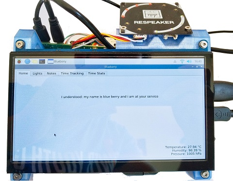

# Blueberry Assistant

Simple **offline** personal assistant (like Alexa, Siri etc), for note taking, time tracking
and controlling your HUE lights. Its based on a Raspberry Pi, written in Python and includes
a GUI.

Your commands and notes are not sent to any big company cloud! No one is listening.
Keep in mind computing power on a raspberry is not that strong and if you want instant responses
to your commands, blueberry is not for you.

This project started with my wish for voice controlling my hue lights without someone listening in.
It was then extended by connecting some freeware programs, e.g.
the amazing Joplin Note taking software, Mozilla Deepspeech and Picovoice Porcupine.

The name Blueberry is one of the default hotwords provided by picovoice, which I found quite fitting:
Blueberry running on a Raspberry ;)

## Table of Contents
1. [Implemented functions](#Implemented-functions)
2. [Shopping list](#Shopping-list)
3. [Installation](#Installation)
4. [Usage](#Usage)
5. [Misc](#Misc)
6. [Future ideas](#Future-ideas)

## Implemented functions
- Speech to Text transcription via Mozilla Deepspeech
- Note and Task taking via Joplin
- Time tracking via CalDav
- Basic weather station with temperature, humidity and air pressure
- Support for Phillips Hue lamps

## Shopping list

### Must haves 
- Rasperry Pi 4 + SD card and power source
- Microphone, e.g., [Seeed studio 4 mic array](https://wiki.seeedstudio.com/ReSpeaker_4_Mic_Array_for_Raspberry_Pi/) (with LEDs)

### Optional
- Display
- Temperature Sensor, e.g., BME280 (can be easily connected to the Seeed studio 4 mic arry)
- 3d Printer for a stand

## Installation
After having setup your raspberry pi (installed raspian buster) you can clone this repository.
You also need the following software:

### Required software
#### Standalone apps
- [Joplin](https://joplinapp.org/terminal/), the command line version (CLI) works on a  Raspberry Pi
- Microphone driver, e.g. seeed studio. I recommend the [Hintak Fork](https://github.com/HinTak/seeed-voicecard)
- To be truly offline, I recommend syncing your notes and calendar via [nextcloud pi](https://ownyourbits.com/nextcloudpi/)
I use an additional (old) SSD for that. Joplin supports nextcloud.
#### Python packages
- [Mozilla Deep Speech](https://github.com/mozilla/DeepSpeech) (STT engine)
- pvporcupine from [Picovoice](https://github.com/Picovoice/porcupine) (Hotword engine)
- PyQt5 (GUI) (may need to be installed with apt-get

- schedule
- PyAudio
- Pandas (required for storing the HUE data)
- Caldav (calendar support)
- apa102-py (LED support for the thermometer)
- SpiDev (LED support )
- GPIOzero (LED support as well)
- SMBus2 (BME280 data transfer)

A list of the employed packages with the tested versions can be found in requirements.txt

### Configuration
Copy the config_example.py file and change to only config.py. We don't want to sync your personal data
to github.

#### Deep speech
Install the python package as well as the language model and scorer and specify the file path in
the config file.

#### Joplin
After having installed [Joplin](https://joplinapp.org/terminal/), (and configured syncing), you need to extract the token for the api calls.
There's a function included in the JoplinHelper file for that. Type it into the config

#### HUE
Here, you need to create a new api user for your HUE bridge as explained 
on the [HUE get started Page](https://developers.meethue.com/develop/get-started-2/).
After that type in the bridge IP and the username (this long string) into the config file.
Specify your default group there as well

#### Time tracking
Only tested with nextcloud. I have two calendars one for the scheduling and one for the time tracking.
Specify in the config file as well as your credentials.

### Other configurations
The command dictionary shows the hot words and the command which should be executed has to be specified
in the blueberry_assistant class with the name. In the example config you can see what is implemented so
far. The other configurations are self-explaining, I hope.

After having installed everything and configured properly, you can execute start_assistant.sh via a cron job for example on reboot.

## Usage
- After hearing the hotword, e.g., Blueberry, your speech is recorded transcribed with deepspeech
and strings are compared for the respective actions, such as changing scenes of your lights,
taking notes or time tracking. 

The following functions are implemented and specified in the config, where more hotwords can be found.
You can also form a complete sentence based on the specified words.

|Functions| Hotword| Action |
|:-------:| :---------:|:----:|
|note taking| take note| waits for your speech and stores it in a joplin folder
|store todo| new task| stores a todo according to your spoken text in joplin
|show notes| show notes| switches to the note tab in the gui
|start work out| work out | starts the tracking of "sport" activity and change the hue scene to a cold temperature
|shut down| shut down| turns off the pi
|start time tracking scheduled activity | start activity| starts the tracking of the activity that is scheduled for now
|stop time tacking activity | done | stops the tracking of any activity
|start tracking default activity | name of the activity | starts tracking one of the default activities
|set hue scene | name of the hue scene | sets a new hue scene for your default group with the spoken name
|increase brightness | more light | increases the brightness of your hue default group
|reduce brightness | dimm lights | reduces the brightness of your hue default group

### Lights
- The name of your hue scenes for your default group (specified in the config are stored) and Blueberry on
hearing the name of the scene, then sets it accordingly. You can also increase and reduce the brightness
(see implemented voice commands)
- You also have the possibility to change scenes adjust brightness and temperature via the gui.

### Time tracking

I have always been so amazed by the people you have the discipline to track their activities
manually. I believe it's important to see where you spend your time on. It helps you adjust to your goals.
Unfortunately, I find the process of tracking too dull. So my goal was to remove the friction.

Blueberry helps you with tracking your time. You need two calendars (One for your planning and
one for tracking) accessible via CalDav. Here, Nextcloud (Pi), for example, would be
a choice that is online-ish but still data protected or can be offline within your home. 
Blueberry then displays for each day your planned activites and you can start 
the tracking by saying "Blueberry start" and stop the tracking by "Blueberry stop", for instance. 
Blueberry saves the time in your tracking calendar and creates a dataframe where you can compare your planning
to your actual performance. 

You can also specify some default tasks, which you can start by saying their name, in the config.

Easteregg: You can connect the planned start of a new activity with your hue lights to always be reminded
work's never late ;-) 

### Note and task taking.
After having set up joplin incl. note syncing on the pi, specify your default "inbox", i.e., joplin folder,
where you'd like to have your notes stored. Then by hearing the correct commands,
Blueberry listens to your text and saves it in your inbox.

### Thermometer
- The thermometer is encoded in the LEDs. 4 green lights mean feel-well temperature. Every °C above
(below) will insert a red (blue) LED.

## Display stand
If you have a 3d printer at hand you can find files for a very basic 2-part stand
for a 10" display in this repository.
I used PETG just to be safe since a PI4 can become quite hot.
Stands can be printed without supports (tested with a Creality Ender 3)
The holes are designed for M3 metal threads to be inserted (for example with a soldering iron). Though, you have
to increase the Raspberry/display holes a little bit for that.

## Misc
- The original Deepspeech model is so far only available in English 
and works ok-ish with a German accent. However, there are third-party models for other languages.
- I'm happy for any feedback.
- Tasks in Joplin can be copied into your calendar if need be via the caldav helper.

## Future ideas
- I plan on replacing deep speech with the Rhino speech to intent actions, this should give
better results even in different languages. And use deepspeech only for general text transcription,
i.e, for storing notes
- The tracked times should be grouped according to your chosen activites if they occour
in the summary or description.
- I also dream of some form of morning briefing that shows you **your** relevant information for
your day
- If you have any wishes or ideas, let me know.
